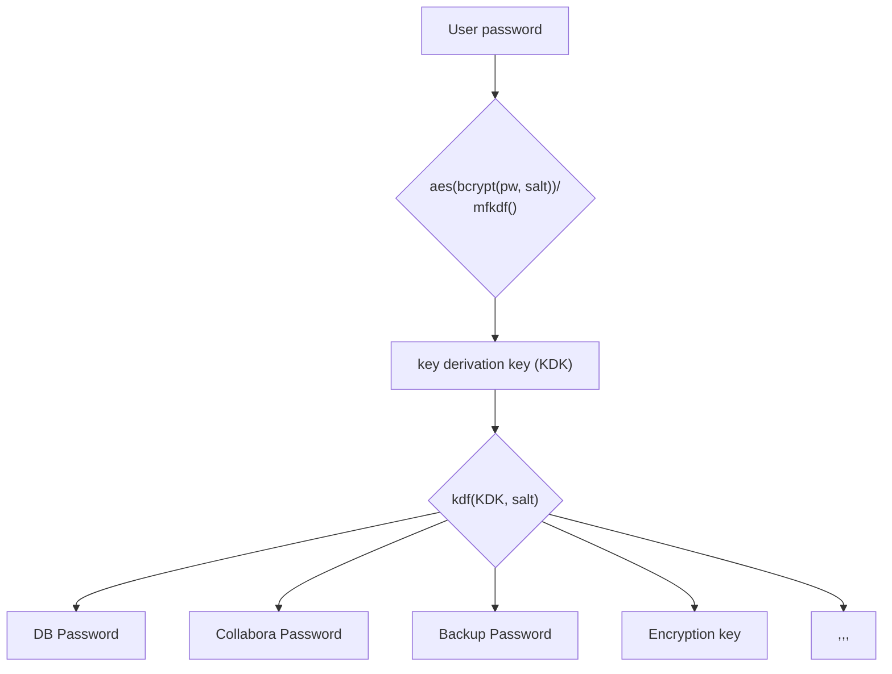

# NCP Secret management

```mermaid
graph TD
    U[User password] --> UM{"aes(bcrypt(pw, salt))/\nmfkdf()"}
    UM --> M["key derivation key (KDK)"]
    M --> MD{"kdf(KDK, salt)"}
    MD --> DP[DB Password]
    MD --> CP[Collabora Password]
    MD --> BP[Backup Password]
    MD --> EP[Encryption key]
    MD --> OP[,,,]
```