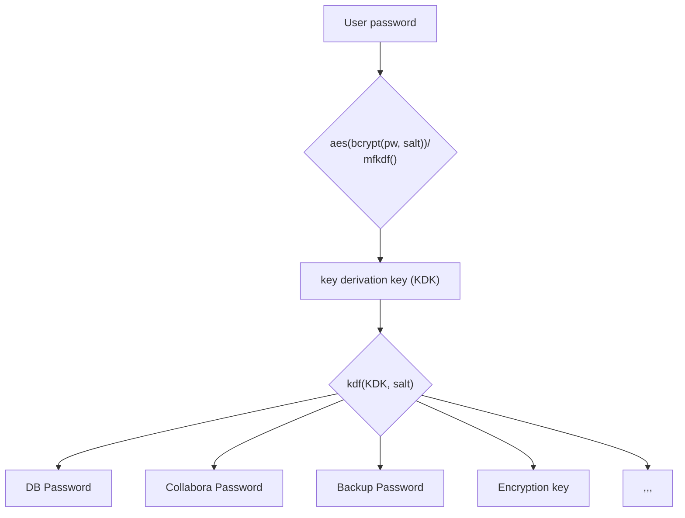

# NCP Security

## Secret management

## Resources (unsorted)

- https://systemd.io/CREDENTIALS/
- https://access.redhat.com/documentation/en-us/red_hat_enterprise_linux/8/html/security_hardening/configuring-automated-unlocking-of-encrypted-volumes-using-policy-based-decryption_security-hardening
- https://www.privex.io/articles/unlock-luks-remotely-ssh-dropbear/